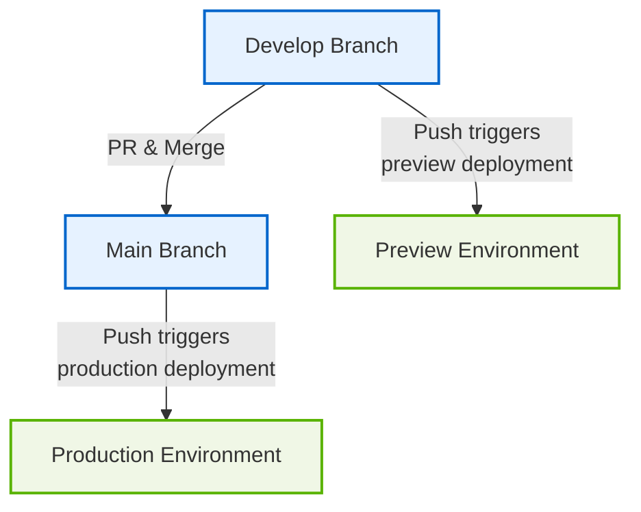

## Overview

This project implements a simple CI/CD pipeline with automated deployments to Cloudflare Pages.

## Workflow Diagram

## Key Workflows

### 1. QA Check (qa-check.yml)

**Purpose:** Validates code quality on pull requests.

**Process:**
- Triggered on pull request events
- Runs linting, formatting checks, and tests
- Ensures code quality standards before merging

### 2. Deployment (deploy.yml)

**Purpose:** Handles deployments to both production and preview environments.

**Process:**
- Triggered on push to `main` or `develop` branches
- Builds the application with Vite
- Deploys to Cloudflare Pages using Wrangler
- For `main` branch:
  - Deploys to production (grupo-raia.org)
- For `develop` branch:
  - Deploys to preview environment (develop.raia.pages.dev)

### 3. Changelog (changelog.yml)

**Purpose:** Automatically updates CHANGELOG.md from conventional commits.

**Process:**
- Triggered on push to `main` branch
- Parses conventional commits (feat, fix, perf, refactor)
- Generates dated changelog entries
- Commits updated CHANGELOG.md back to repository
- Skips docs, style, test, build, ci, and chore commits

### 4. GPG Key Retrieval (retrieve-gpg-key.yml)

**Purpose:** Handles secure GPG key operations for signing commits.

**Process:**
- Provides secure access to GPG keys for authenticated operations
- Supports commit signing and verification processes

## Branching Strategy

- **main:** Production-ready code, deploys to grupo-raia.org
- **develop:** Integration branch for features, deploys to preview
- **feature/\*:** Feature branches, merged to develop via PR

## Deployment Identification

Instead of semantic versioning, deployments are identified by:
- **Git commit SHA** - unique identifier for each deployment
- **Cloudflare deployment ID** - automatically generated by Cloudflare Pages
- **Timestamp** - when the deployment was created

This approach is more suitable for web applications where:
- Users don't need to track version numbers
- Continuous deployment is the norm
- Rollbacks are handled through Cloudflare Pages dashboard

## Configuration Files

- **package.json:** Contains dependencies and project metadata
- **.github/workflows/:** CI/CD workflow definitions

## Security & Authentication

- Uses Cloudflare API tokens for deployment
- GitHub Actions handles CI/CD securely
- Environment variables stored in GitHub repository settings

## Environments

- **Production:** https://grupo-raia.org (main branch)
- **Preview:** https://develop.raia.pages.dev (develop branch)
- All deployments leverage Cloudflare Pages for hosting
